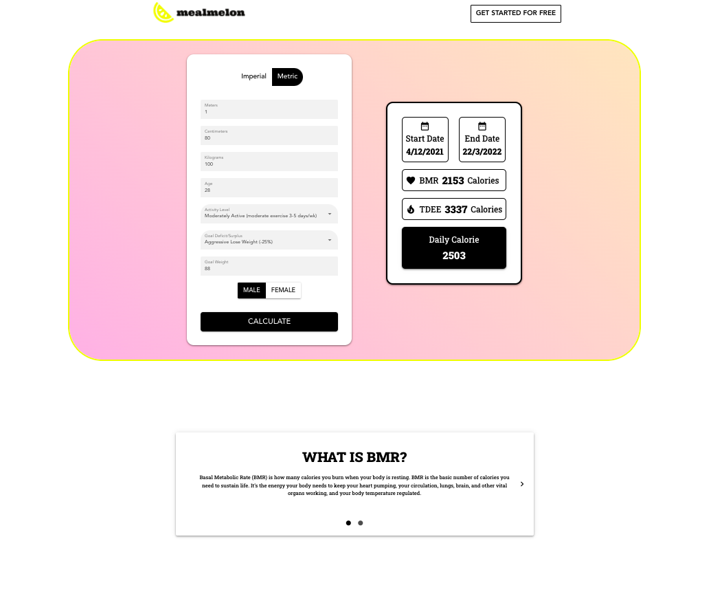

<p align="center">
   
</p>

# mealmelon

> Easy Meal Planner

<br />

<p float="left">
  
  
</p>

# :construction_worker: Installation

You need to install Node.js first, then in order to clone the project via HTTPS, run this command:

`git clone https://github.com/ASK-v1/mealmelon.git`

SSH URLs provide access to a Git repository via SSH, a secure protocol. If you have a SSH key registered in your Github account, clone the project using this command:

`git clone git@github.com:ASK-v1/mealmelon.git`

### Install dependencies

```
cd frontend
npm install
```

### Running Development Web Server

`npm run serve`

# :closed_book: License

This project is under the [MIT license](https://github.com/ASK-v1/mealmelon/blob/main/LICENSE).
Released in 2021.
